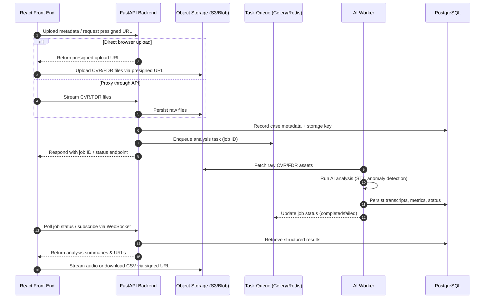

# CVR/FDR Analysis Workflow Overview

## Viewing this document

This Markdown file includes an embedded Mermaid sequence diagram. You can open it in any Markdown viewer—GitHub, VS Code, JetBrains IDEs, and most browsers with Markdown extensions all render the diagram automatically. If you prefer a standalone asset for sharing, use the Mermaid CLI to export the diagram:

```bash
npx -y @mermaid-js/mermaid-cli -i docs/cvr-fdr-workflow-diagram.md -o docs/cvr-fdr-workflow.png
```

The command above generates a `docs/cvr-fdr-workflow.png` snapshot that you can distribute to your team or embed in presentations. Adjust the output filename or format (for example, `-o docs/cvr-fdr-workflow.pdf`) as needed.

The diagram below illustrates how the React front end, FastAPI backend, task workers, and storage layers collaborate to process Cockpit Voice Recorder (CVR) and Flight Data Recorder (FDR) submissions.



## Key Interaction Notes

- **Presigned uploads** minimize backend load by letting the browser upload directly to object storage while keeping control via short-lived credentials.
- **Asynchronous task execution** ensures long-running AI jobs do not block API responsiveness.
- **PostgreSQL** stores metadata, job tracking, transcripts, anomaly flags, and signed URL references—never the large binaries themselves.
- **Object storage** handles large CVR/FDR files with lifecycle policies for archival and cost control.
- **Real-time updates** can use polling or WebSockets from the front end to surface progress and results as they land.

This flow keeps the system modular, scalable, and aligned with the existing React SPA architecture.
