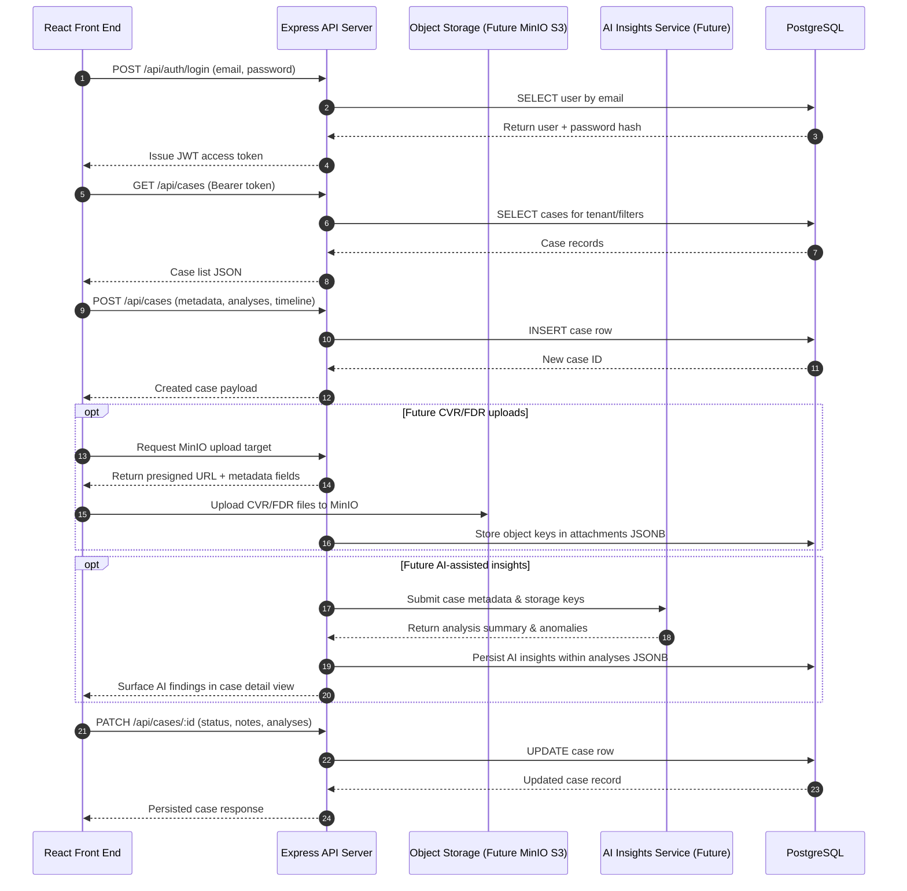

# CVR/FDR Analysis Workflow Overview

## Viewing this document

This Markdown file includes an embedded Mermaid sequence diagram. You can open it in any Markdown viewer—GitHub, VS Code, JetBrains IDEs, and most browsers with Markdown extensions all render the diagram automatically. If you prefer a standalone asset for sharing, use the Mermaid CLI to export the diagram:

```bash
npx -y @mermaid-js/mermaid-cli -i docs/cvr-fdr-workflow-diagram.md -o docs/cvr-fdr-workflow.png
```

The command above generates a `docs/cvr-fdr-workflow.png` snapshot that you can distribute to your team or embed in presentations. Adjust the output filename or format (for example, `-o docs/cvr-fdr-workflow.pdf`) as needed.

The diagram below illustrates how the React front end, Express backend, PostgreSQL database, and the planned MinIO object storage layer collaborate to manage CVR/FDR cases.



## Key Interaction Notes

- **Authentication & authorization** rely on JWT tokens issued by the Express API after validating user credentials against PostgreSQL.
- **Case management** flows (list, create, update) travel from the React client through the REST endpoints to PostgreSQL using the existing services and data mappers.
- **Structured artifacts** such as analyses, timelines, and attachments are persisted as JSONB within the `cases` table until binary asset storage is introduced.
- **Object storage (planned)** will use MinIO to host large CVR/FDR files, with presigned URLs generated by the API and the resulting keys stored alongside case metadata.
- **AI-assisted insights (planned)** will process stored recordings via a dedicated AI service, feeding summary findings back through the API so they can be reviewed within each case.

This flow keeps the system modular, scalable, and aligned with the existing React SPA architecture.