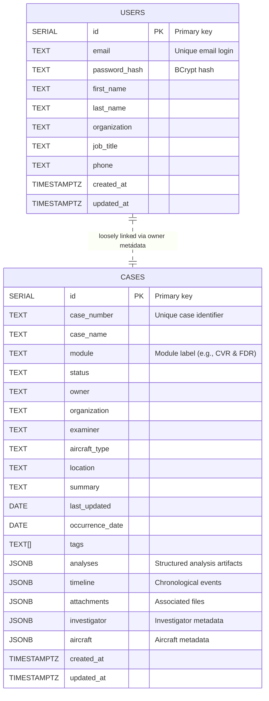

# System Diagrams

This document captures two high-level views of the CVR/FDR Analyzer platform: the relational data schema used by the backend service and the runtime interactions between major system modules.

## Data Schema



## System Module Interaction

```mermaid
flowchart LR
    subgraph Frontend [React Frontend]
        UI[Pages & Components\n(src/pages, src/components)]
        Hooks[Custom Hooks\n(src/hooks)]
        APIClient[API Client\n(src/api)]
        UtilsFE[Utilities\n(src/utils)]
    end

    subgraph Backend [Express API Server]
        Routes[routes/*\nRequest routers]
        Middleware[middleware/*\nAuth & error handling]
        Services[services/*\nBusiness logic]
        UtilsBE[utils/*\nToken, validation, mapping]
        DBLayer[db/pool.js\nDatabase access]
    end

    subgraph Database [PostgreSQL]
        CasesTable[(cases table)]
        UsersTable[(users table)]
    end

    UI --> Hooks
    Hooks --> APIClient
    APIClient -->|HTTP/JSON| Routes
    Routes --> Middleware
    Middleware --> Services
    Services --> UtilsBE
    Services --> DBLayer
    DBLayer -->|SQL queries| CasesTable
    DBLayer -->|SQL queries| UsersTable

    UtilsFE -.-> UI
    UtilsBE -.-> Middleware

    APIClient <-->|Auth tokens| Middleware
```

The first diagram reflects the structure defined in [`server/db/schema.sql`](../server/db/schema.sql). The second diagram summarizes how React UI layers invoke the API client, which communicates with Express routes; those routes funnel requests through middleware into service modules that interact with shared utilities and the PostgreSQL tables via the database layer.