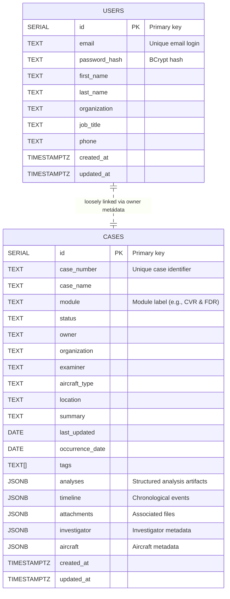

# System Diagrams

This document captures two high-level views of the CVR/FDR Analyzer platform: the relational data schema used by the backend service and the runtime interactions between major system modules.

To export these diagrams as images with legible text, use the Mermaid CLI. The first command emits a standard-resolution PNG, while the second increases the canvas dimensions for presentations and reports:

```bash
npx -y @mermaid-js/mermaid-cli -i docs/system-diagrams.md -o docs/system-diagrams.png
npx -y @mermaid-js/mermaid-cli -w 1800 -H 1200 -i docs/system-diagrams.md -o docs/system-diagrams@2x.png
```


## Data Schema



## System Module Interaction

```mermaid
flowchart LR
%%{init: {"themeVariables": {"fontSize": "16px", "fontFamily": "'Inter', 'Arial', sans-serif"}, "flowchart": {"htmlLabels": true}} }%%
flowchart TB
    subgraph Frontend [React Frontend]
        UI["Pages & Components<br/>src/pages, src/components"]
        Hooks["Custom Hooks<br/>src/hooks"]
        APIClient["API Client<br/>src/api"]
        UtilsFE["Utilities<br/>src/utils"]
    end

    subgraph Backend [Express API Server]
        Routes["routes/*<br/>Request routers"]
        Middleware["middleware/*<br/>Auth & error handling"]
        Services["services/*<br/>Business logic"]
        UtilsBE["utils/*<br/>Token, validation, mapping"]
        DBLayer["db/pool.js<br/>Database access"]
        StorageSvc["storage/*<br/>Future MinIO integration"]
    end

    subgraph Database [PostgreSQL]
        CasesTable[(Cases Table)]
        UsersTable[(Users Table)]
    end

    subgraph ObjectStorage ["Object Storage<br/>(Future MinIO S3)"]
        MinIO["MinIO buckets<br/>for CVR/FDR data"]
    end

    UI --> Hooks
    Hooks --> APIClient
    APIClient -->|HTTP/JSON| Routes
    Routes --> Middleware
    Middleware --> Services
    Services --> UtilsBE
    Services --> DBLayer
    Services -.-> StorageSvc
    StorageSvc --> MinIO
    DBLayer -->|SQL queries| CasesTable
    DBLayer -->|SQL queries| UsersTable

    UtilsFE -.-> UI
    UtilsBE -.-> Middleware

    APIClient <-->|Auth tokens| Middleware
```

The first diagram reflects the structure defined in [`server/db/schema.sql`](../server/db/schema.sql). The second diagram summarizes how React UI layers invoke the API client, which communicates with Express routes; those routes funnel requests through middleware into service modules that interact with shared utilities and the PostgreSQL tables via the database layer. The storage service node highlights the planned integration with a MinIO-backed S3 object store to hold CVR/FDR artifacts alongside relational case data.


